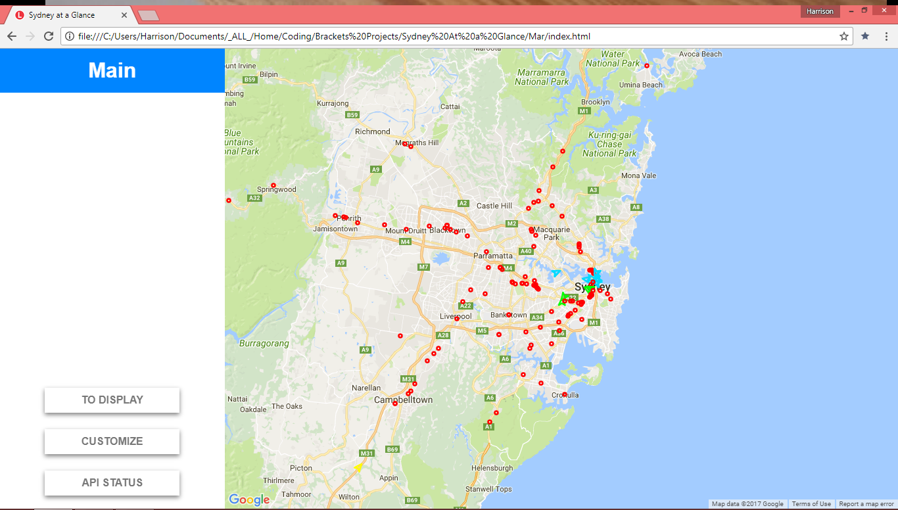
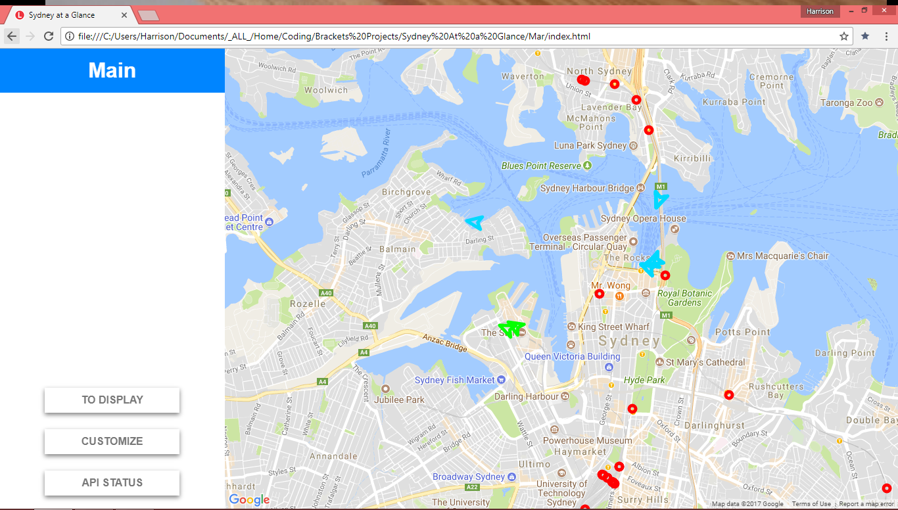
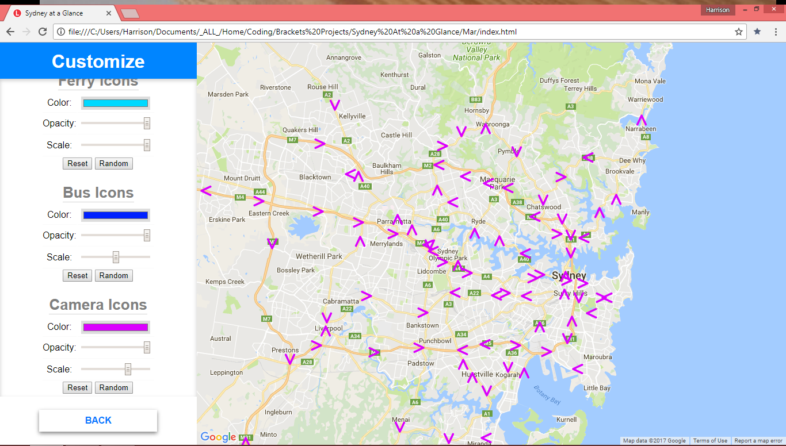
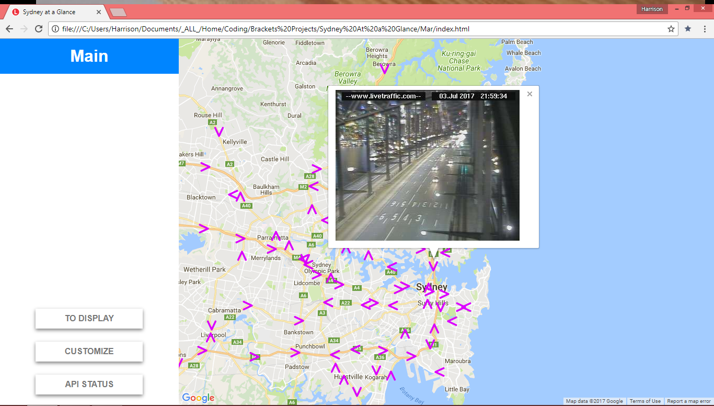
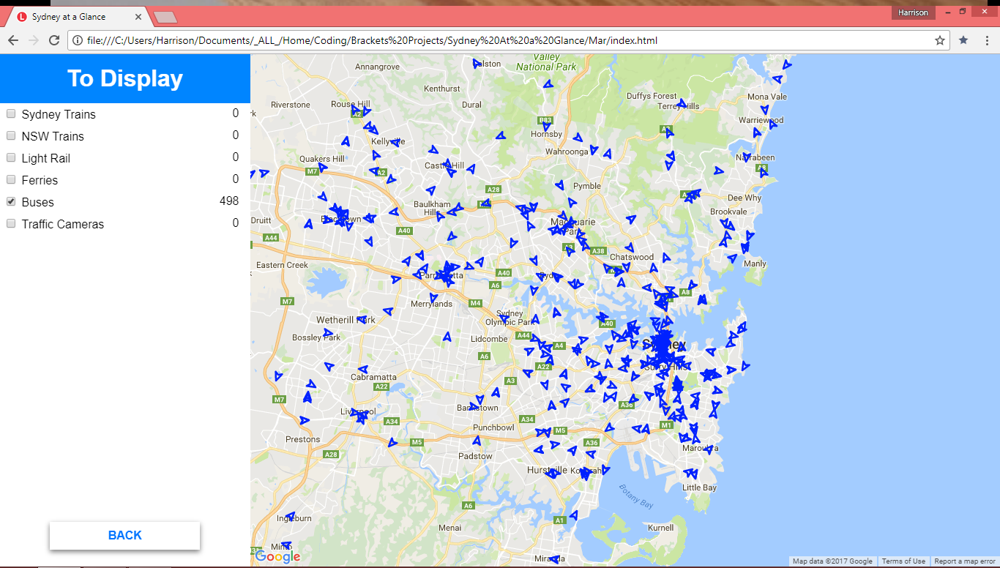
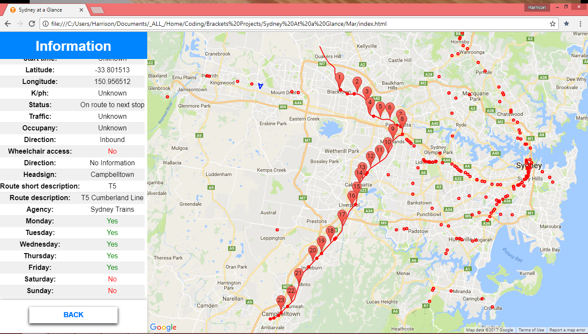

# Sydney At A Glance
See every public vehicle in Sydney moving live around a map with real time information on occupancy, traffic, whether the service caters for the disabled, what the next stop is etc...

This project was done for my High School Software Design and Development major work in which I recieved full marks and inherently topped the class. If you're interested in seeing a loosly reflective logbook, psudocode and more, I've included what I handed in as part of the major work in the `documentation` folder.

### Dependencies
* Python >= 3.5
* NODEJS

### Installation
* `pip install pandas`
* `npm install gtfs-realtime-bindings request http fs readline cheerio`

### Usage
1. Daily, `generateData/downloadUnpackTrim.py` will have to be run to download latest timetables and to clean up and prune data for use in the main application
1. Add your [NSW Open Transport Data API key](https://opendata.transport.nsw.gov.au/) to `assets/scripts/server.js`
1. Add your [Google Maps API key](https://developers.google.com/maps/) to `index.html`
1. Run node `assets/scripts/server.js` from the root folder
1. Open `index.html` in either Chrome or Firefox

### Known issues
* Occasionally, the update tool fails. Try again at a later point
* Occasionally, vehicle data can't be shown due to inconsistent data formats
* When showing all buses, the program can run slow due to the sheer number of buses
* Sydney trains have no bearing (direction) as they don't use GPS but rather track signals
* Ferries were observed to gain wheels and roll over Sydney's CBD, thus ferry shape data is disabled

### User guide
#### Navigating the Map
Using your mouse, you can click and drag on the map to pan around and you can use your scroll wheel to zoom in or out of the map. Using these methods together will allow you full control over where and what the map displays.

#### Selecting what to Display
Clicking on the “to display” button will show a panel from which you can select which vehicles you want to display and whether or not you want traffic cameras shown or not. Clicking on the “back” button will return you to the main menu.

#### Customizing the Display
From the “customize” button on the main menu, you can select a map style to display. Clicking on one will change the map to the new, selected style. There is also the option of importing your own JSON Google Map styling. Styles can be made and found at [Snazzy Maps](https://snazzymaps.com/). Scrolling further down the menu will reveal options where you can adjust the size, color and opacity of each vehicle/camera marker. There are also buttons to randomize the three and revert them to normal. Clicking “back” will return you to the main menu.

#### Checking API Statuses
The “API status” button allows you to check that each of the used APIs in the application are online and operational. Coming to this screen can be useful for debugging purposes.

#### Seeing a Vehicle's Information
Clicking on any vehicle will change the information panel to a table of values from that specific vehicle. This table loads alongside the route being drawn on the map as well as placing pins at each stop that vehicle makes. Clicking on any of these pins will open a streetview view of that location in a new tab. Panning away from your vehicle will result in a button in the bottom right appearing that, when clicked, will pan you back to the vehicle you selected. Clicking another vehicle will pan you and show you it’s information, otherwise, clicking on the “back” button on the bottom left will return you to the main menu and remove any information that was drawn on the map.

#### Viewing from a Traffic Camera
Clicking on a traffic camera will result in a window popping up showing you an image of what it sees. This image updates once a minute. Depending on the specifics of your computer and browser version, this image may update live or might not. If not, just click on the camera again after closing its window.

#### Turning off the Server
This can be done by navigating back to the server console and pressing Ctrl-C or by simply clicking the X.

### Screenshots
Main screen showing Sydney trains and Lightrail

 

Above but zoomed in

 

Customization screen and display of all traffic cameras

 

The view of the Harbour Bridge's traffic camera at night

 

Vehicle selection screen with 500 buses displayed on the map

 

Every mode of transport displayed with traffic cameras

 

The screen displayed when clicked on a vehicle, here a Sydney train. K/ph, traffic and occupancy is only known for buses currently (as per the API)

